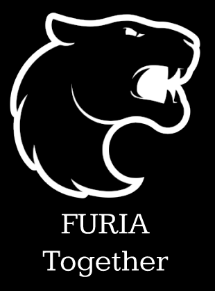

# Furia Together

> Um aplicativo desenvolvido para conectar torcedores da FURIA, facilitando a organização de caronas para eventos e a revenda segura de ingressos entre fãs.

## ✨ Tecnologias Utilizadas
- Figma (protótipos de alta fidelidade)

## 🎨 Protótipo
Acesse o protótipo clicando no link abaixo:

[🔗 Acessar o projeto no Figma](https://www.figma.com/proto/d6NyhSRVoWYNkz3Dtu3rKF/Furia-Together?node-id=1-4&p=f&t=ZlhBmZIBWFJe6rmq-1&scaling=scale-down&content-scaling=fixed&page-id=1%3A2&starting-point-node-id=1%3A4)

## 📄 Descrição
O **Furia Together** foi criado para aproximar a comunidade de torcedores da FURIA, oferecendo:
- Organização de caronas para eventos presenciais.
- Plataforma segura para venda e compra de ingressos entre torcedores.
- Experiência de uso prática e intuitiva, focada em segurança e confiabilidade.

## 📸 Telas Desenvolvidas
- Splash Screen
- Tela de Login
- Tela de Perfil
- Tela de Caronas Disponíveis
- Tela de Venda e Compra de Ingressos
- (Adicione aqui outras telas, se houver.)

## 🚀 Como acessar o projeto
- Acesse o link do Figma.
- Caso queira duplicar o projeto: `Arquivo > Duplicar para seus arquivos` dentro do Figma.

## 🧠 Aprendizados
- Criação de fluxos de navegação voltados para o usuário final.
- Aplicação de princípios de design de interfaces focados em usabilidade.
- Prototipagem rápida para validação de ideias.

## 📌 Status do Projeto
- ✅ Finalizado (protótipo pronto)

---

## 👨‍💻 Autor

- **Matheus Alphonse**
- [LinkedIn](https://www.linkedin.com/in/matheus-alphonse-802637262/) | [GitHub](https://github.com/matheustm29)
